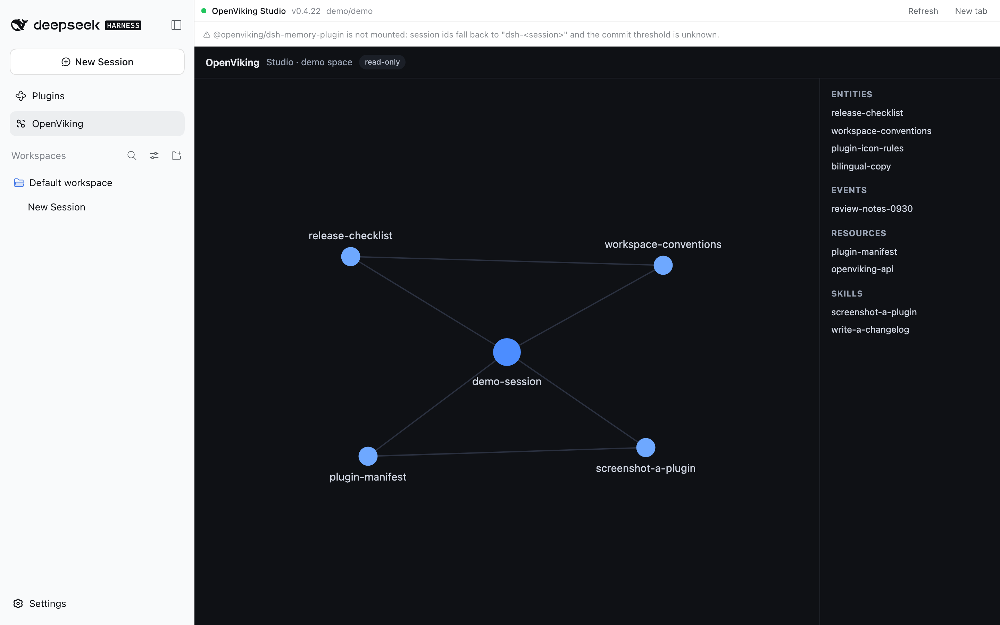

# dsh-openviking-enhance

English | [中文](README.zh.md)

**v0.1.0** · [Changelog](CHANGELOG.md)

Brings your local [OpenViking](https://docs.openviking.ai) memory server into the
DeepSeek Harness (DSH) Web GUI: a Studio panel in the left sidebar, and a commit
status pill under the message box that shows what each session commit did to your
memories.

Nothing needs to be patched in DSH or in the OpenViking plugin — it mounts as an
ordinary DSH bundle.

## What you get

**OpenViking Studio, inside DSH.** A new row at the bottom of the left sidebar
opens the OpenViking server's own Studio UI in the main area, so you can browse
memories, sessions and retrieval without leaving the app or switching to a browser.

**Per-session commit status.** OpenViking writes memory in *commits*: a session's
turns accumulate until a token threshold is reached (or the session ends), then
they are archived and the memories are extracted. The pill under the message box
tells you where the session you are looking at stands.

The pill follows the app's language (see *Notes*); in English it reads:

| Pill | Meaning |
| --- | --- |
| `OV · not committed` | Nothing from this session has been committed yet |
| `OV · 12.3k/20k` | Turns are accumulating towards the commit threshold |
| `OV · extracting…` | A commit is being archived and its memories extracted |
| `OV · 3 commits` | Three commits so far |
| `OV · extraction failed` | A commit was archived but its memories could not be extracted |
| `OV · unavailable` | The local OpenViking server cannot be reached |

Click the pill for details:

- a **timeline** of the most recent 3 commits — when each happened and how many
  memories it added, updated or deleted (the rest are one click away);
- clicking a commit lists the **exact memories it changed**, with their
  `viking://` paths;
- any **failed extraction**, with the time, how long it ran, and the reason the
  server reported.

The panel and the pill read only. This plugin never commits, writes or deletes
anything in OpenViking.

**What this session retrieves.** The right sidebar gains a *Memory recall* tab: it shows what OpenViking pulls in for the session you are looking at
— the query it searched with (that session's most recent message, or one you type
yourself), every hit in each of its three sources (memories, resources, skills)
with its score — graded from red through orange to green — its file name, its kind
(`entity`, `event`, …) and its abstract. The full `viking://` path is on hover, and
opening a row loads that entry's whole text. The plan the server retrieved with is there
too. Open it from the right sidebar's `+`
guide; it is per session, like the column itself.



The Studio panel, the sidebar row that opens it, and the commit pill below the composer.

## Requirements

| | |
| --- | --- |
| DSH | 0.2.0-rc.2 or newer (desktop or web profile) |
| OpenViking | A local server; 0.4.22 tested. Studio is served at `/studio/` on the same port |
| Memory plugin | `@openviking/dsh-memory-plugin` recommended — it is what commits sessions. Without it the panel still works, but pending-token thresholds are unknown |

## Install

Install it from the Plugins page (Add plugin → package name or tarball), or:

```bash
# a published release
dsh plugin --profile desktop add dsh-openviking-enhance
```

Installing straight from a Git URL is refused by pnpm — the package asks to run a
build script and pnpm blocks those until they are allowed — so a source checkout is
installed as a tarball instead. The client half is a prebuilt bundle: a source
install would have nothing to load.

```bash
pnpm pack && dsh plugin --profile desktop add ./dsh-openviking-enhance-<version>.tgz
```

Then restart the DSH app once: the host half is loaded at startup. To remove it:

```bash
dsh plugin --profile desktop remove dsh-openviking-enhance
```

## Configuration

Everything has a sensible default — a standard local setup needs no configuration
at all. To change something, open **Plugins** in the sidebar, pick this plugin, and
use **Configure** on its row: the form carries the fields below, a **check**
button that probes the address before you save, and a *default* button per field
that clears the override instead of writing an empty value.

The same settings can still be written by hand in your profile's patch file
(`~/.dsh/profiles/desktop/cordis.patch.yml`), under the row `openviking-enhance`:

```yaml
- id: openviking-enhance
  name: 'dsh-openviking-enhance'
  config:
    endpoint: http://127.0.0.1:1933
```

| Field | Default | Meaning |
| --- | --- | --- |
| `endpoint` | from `~/.openviking/ovcli.conf`, else `http://127.0.0.1:1933` | OpenViking base URL |
| `apiKey` | from `ovcli.conf` | Only needed if the server requires authentication |
| `account` / `user` | `default` / `default` | Identity the panel reads under |
| `studioPath` | `/studio/` | Where Studio is served on that origin |
| `cacheTtlMs` | `2500` | How long a status answer is reused |

## Troubleshooting

**No OpenViking row in the sidebar, or no pill under the message box.**
The client half is served as a file and picked up on page load. Reload the window
(⌘R). If it is still missing, restart the app.

**The panel says it cannot reach OpenViking.**
Start the server and check it directly: `curl http://127.0.0.1:1933/health`. The
panel shows the address it tried, which helps when `endpoint` is not the default.

**The pill says extraction failed.**
The commit was archived but OpenViking could not turn it into memories — those
memories are not in your library. Click the pill for the server's own error; it is
usually a problem with the extraction model configured in `~/.openviking/ov.conf`.

**The pill shows a token count instead of a commit count.**
`@openviking/dsh-memory-plugin` is not installed, so the commit threshold is
unknown. Commits themselves still work; only the progress denominator is missing.

**The timeline shows only 3 commits.**
That is the default. Click *show all*.

**There is no recall tab in the right sidebar.**
The tab is reached through that column's own `+` guide, and it only exists after a
window reload (the client half is a file the page loads). If DSH is older than
0.2.0-rc.2 it has no right sidebar to contribute to: the row is skipped and the
Studio panel and the pill keep working.

**I changed the code and nothing happened.**
The two halves reload differently: the client half after a window reload, the host
half only after an app restart.

## Notes

- **The plugin's own text follows the app's language.** It ships Chinese and
  English and reads the locale DSH sets, so switching the app's language switches
  this plugin's copy too; anything else falls back to English.
- OpenViking cleans up its commit task records over time, so the failure list
  covers recent commits only. The archives themselves are permanent.
- The plugin's internal routes answer loopback requests only, and only from the
  DSH window's own origin.

## Development

```bash
pnpm install
pnpm run build      # lib/index.js (host) + lib/client.js (browser)
pnpm test           # typecheck, packaging contract, unit tests, smoke harnesses
pnpm run watch      # rebuild on change
```

The smoke harness prints the commit timeline without needing the GUI, and skips the
live-data part when OpenViking is not running (`SMOKE_REQUIRE_SERVER=1` makes that a
failure instead). The code comments explain how the pieces fit together.

The version lives in `package.json` and is tagged `vX.Y.Z` in git; while it is `0.x`
the internals may still change. See [CHANGELOG.md](CHANGELOG.md) for what each
release contains, and [RELEASING.md](RELEASING.md) for the release steps and the
GUI acceptance checklist — that one is a maintainer document, Chinese only.
